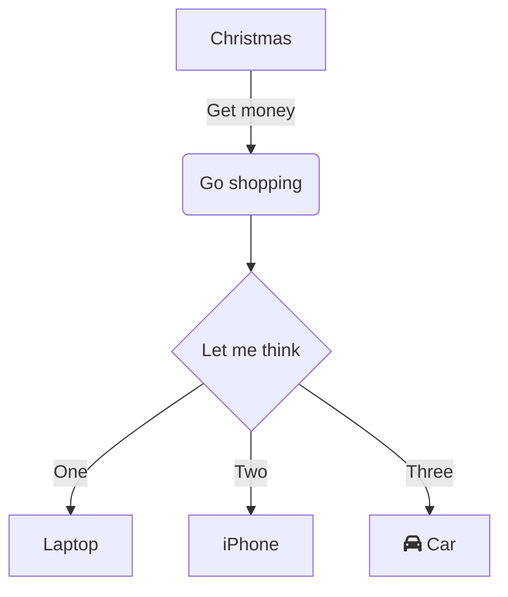
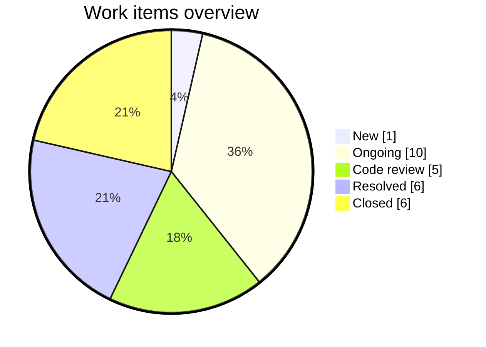
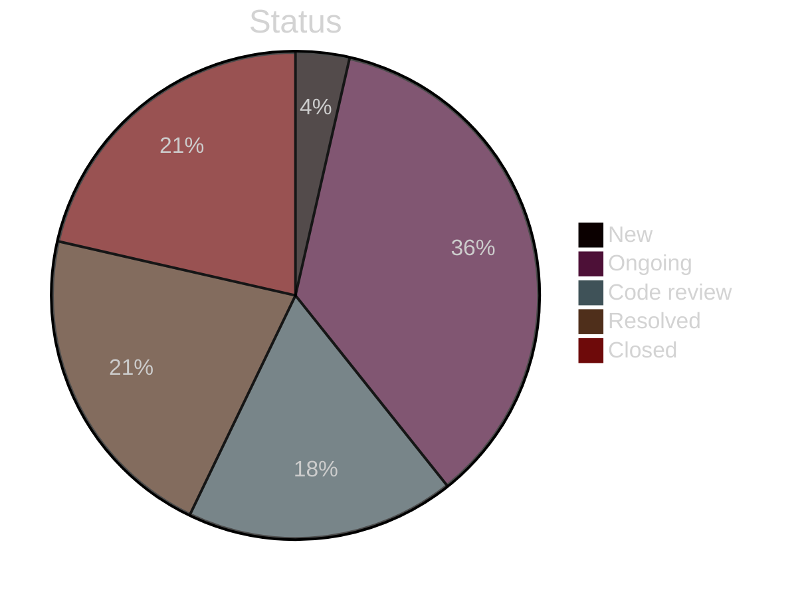
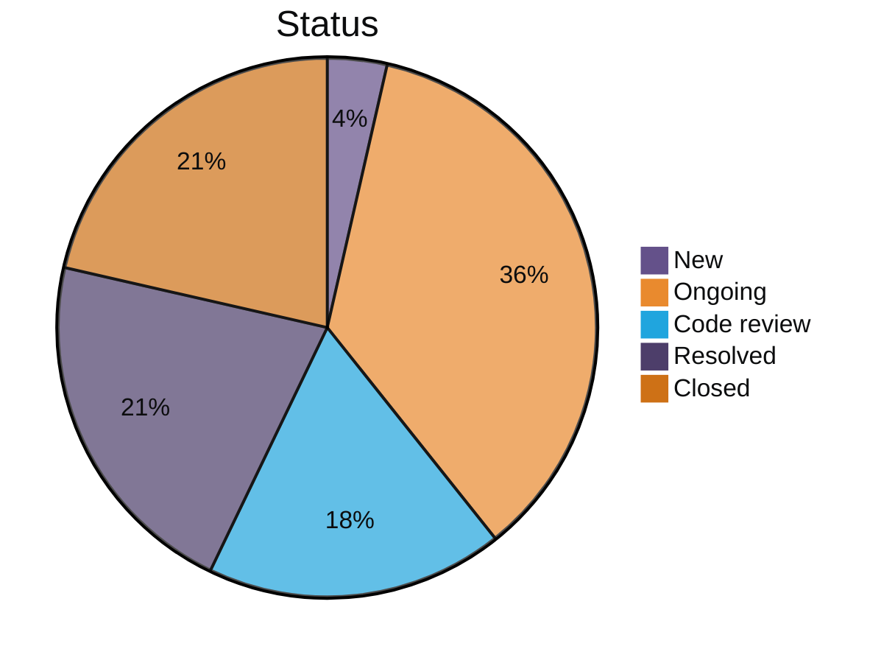
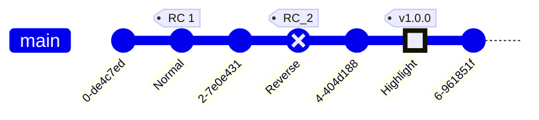
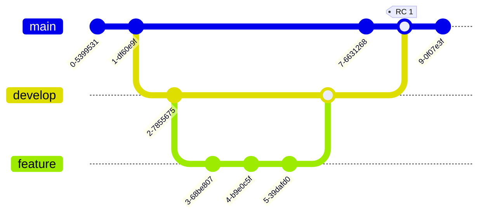
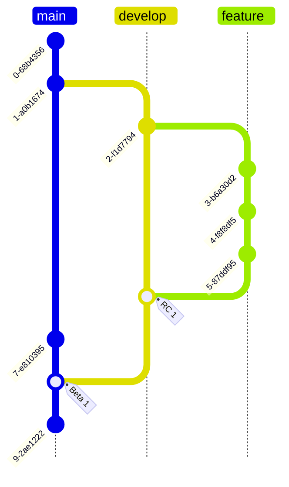

# mermaid-playground
Mermaid playground

## Flowchart

## Pie chart

### showdata and style outer stroke

### dark theme

### Custom colors

## Git graph

### Tags

### No branch label, no commit labels

### Merges

### Top to bottom

